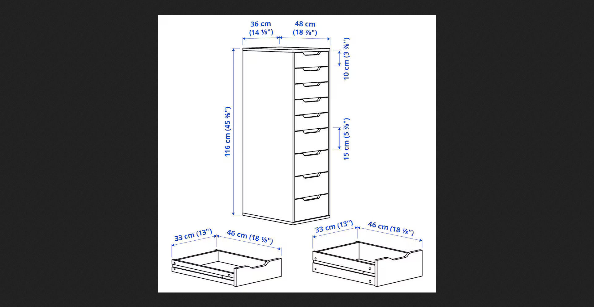

# Ikea Alex Drawer Design for Gridfinity

## 116cm x 36cm

### 1. [Ikea Alex Drawer](https://www.ikea.com/de/de/p/alex-schubladenelement-9-schubladen-weiss-90486139/)

## Dimensions

There are small and big drawers. The small drawers are 32cm x 36cm and the big drawers are 72cm x 36cm.

The innner dimesnions of the big drwaers are:
Height: 13cm
Width: 29.4cm
Length: 42.3cm

Gridfinity Baseplate requeired:

Grid:
294 mm / 42 mm = 7 ( width = 294 mm )
423 mm / 42 mm = 10 ( length = 420 mm )
Gap to be filled in Y direction = 3 mm

Using this tool to create baseplate:
https://gridfinitygenerator.com/baseplate

P1S Printer Plate is 256mm x 256mm

256 mm / 42 mm = 6 ( width = 252 mm )
Breaking down the baseplate into 4 parts:

1 . 5 X 6
2 . 5 X 4
3 . 2 X 4
4 . 2 X 6

